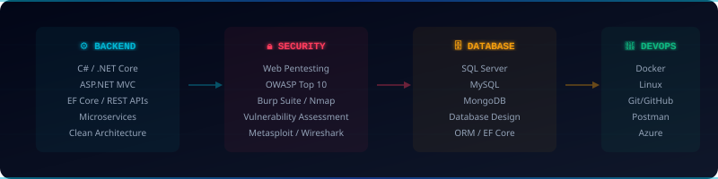

<p align="center"><b>.NET Backend Developer | Cybersecurity Analyst | Penetration Tester</b></p>
<p align="center">
 <a href="https://github.com/3bdelazizmo7amed3bdelaziz-beep"></a>
 <a href="https://linkedin.com/in/abdelaziz-mohamed-b0ba4a343"></a>
 <a href="mailto:3bdElazizMo7amed3bdElaziz@gmail.com"></a>
</p>

<p align="center"><i>Building secure, scalable backend systems and hardening applications through OWASP-driven pentesting — from clean architecture and APIs to vulnerability assessments and security audits.</i></p>

---

### 💻 HERO TERMINAL


```text
┌──────────────────────────────────────────────────────┐
│ abdelaziz@systems:~$                                 │
│                                                      │
│ $ whoami                                             │
│ Abdelaziz Mohamed Abdelaziz Ali                      │
│                                                      │
│ $ role                                               │
│ .NET Backend Developer & Cybersecurity Analyst       │
│                                                      │
│ $ stack                                              │
│ C# • ASP.NET Core • EF Core • Pentesting • DevOps    │
│                                                      │
│ $ mission                                            │
│ Build • Secure • Scale • Architect                   │
│                                                      │
│ SYSTEM STATUS: ONLINE ●                              │
└──────────────────────────────────────────────────────┘
```
---

### ✨ About Me — End-to-End Builder


I'm **Abdelaziz Mohamed** — **Backend & Security Engineer** from **Cairo, Egypt** 

> Instead of being *just* a backend dev or *just* a pentester, I connect the dots: **Architecture → ASP.NET Core → EF Core → SQL Server → REST API → Docker → Security Audit**. That **End-to-End** perspective is my edge. Aiming for Senior/Architect-level backend engineering.

- 🔒 **Application Security & Pentesting** — Gray-box web app pentests, OWASP Top 10, vulnerability assessments
- 🚀 **6+ Systems & Applications Built** — Enterprise backends, ERP systems, AI security platforms
- 🧪 **5 Intensive Bootcamps (2026)** — NTI (72h + 120h), ITI Cybersecurity, ITI .NET, Rowad Masr
- 📍 **Cairo, Egypt** | 📧 [3bdElazizMo7amed3bdElaziz@gmail.com](mailto:3bdElazizMo7amed3bdElaziz@gmail.com)

**Pipeline:** `Architecture → C# / ASP.NET Core → EF Core → SQL Server → REST API → Docker → Pentest`

### 📊 Complete Skills Overview

| Domain | Skills & Technologies |
|---|---|
| **Backend / .NET** | C#, .NET, ASP.NET Core, EF Core, CLR, LINQ, REST API, Web API, JWT, Microservices, Clean Architecture |
| **Cybersecurity** | Penetration Testing, OWASP Top 10, Burp Suite Pro, Nmap, Metasploit, Wireshark, SQLmap, OSINT, SAST, DAST |
| **Databases** | SQL Server, T-SQL, MySQL, MongoDB, Database Design, Query Optimization, ORM |
| **Cloud & DevOps** | Microsoft Azure, Azure DevOps, Docker, Git/GitHub, CI/CD, Linux, Postman, Nginx |
| **Networking** | Cisco Networking, CCNA, VLANs, Routing Protocols, TCP/IP, Network Security |
| **Full Stack** | React.js, Angular 18, Node.js, Express.js, JavaScript, TypeScript, HTML/CSS, Tailwind CSS |

<br clear="right"/>

---

### 🧠 Core Expertise
**Backend Development** — C#, ASP.NET Core, EF Core, CLR, LINQ, REST APIs, Microservices, Clean Architecture, SOLID
**Cybersecurity** — Web Pentesting, OWASP Top 10, AppSec, Burp Suite Pro, Nmap, Wireshark, Metasploit, OSINT
**Databases** — SQL Server, T-SQL, MySQL, MongoDB, Entity Framework Core, Database Design, Query Optimization
**DevOps & Cloud** — Docker, Azure, Linux, Git, CI/CD, Nginx, Azure DevOps, Postman

---

### 🎯 Four Pillars, One Pipeline
<p align="center">
 
 
 
 
</p>

| Pillar | Focus | Key Skills |
|---|---|---|
| ** Backend .NET** <br/> *Architecture & APIs* | Enterprise-Grade Systems | `C#` `ASP.NET Core` `EF Core` `REST APIs` `JWT` `Microservices` `Clean Architecture` `SOLID` |
| ** Cybersecurity** <br/> *Offensive & Defensive* | AppSec & Pentesting | `Burp Suite Pro` `Nmap` `Metasploit` `Wireshark` `OWASP ZAP` `Nikto` `OWASP Top10` `OSINT` |
| ** Databases** <br/> *Data Architecture* | Relational & NoSQL | `SQL Server` `T-SQL` `MySQL` `MongoDB` `Database Design` `EF Core ORM` `Query Optimization` |
| ** DevOps & Cloud** <br/> *Infrastructure* | Deployment & Automation | `Docker` `Azure` `Linux` `Git` `CI/CD` `Nginx` `Azure DevOps` `Postman` |

---

### 💼 Experience & Projects

```text
┌─────────────────────────────────────────────────────────────────────────┐
│ 💻 Backend Developer (Freelance)          │  Jun 2023 – Present        │
│    ▸ Full-stack apps end-to-end with C#/ASP.NET Core/EF Core           │
│    ▸ ClothFlow ERP (Inventory, POS, Sales, HR, Finance)                │
├─────────────────────────────────────────────────────────────────────────┤
│ 🔒 Cybersecurity Analyst — Web Pentesting │  Jan 2025 – Present        │
│    ▸ Gray-box web app pentests (OWASP Top 10 methodology)              │
│    ▸ Professional vuln reports (SQLi, XSS, Auth Bypasses, IDOR)        │
└─────────────────────────────────────────────────────────────────────────┘
```

| Project | Description | Tech Stack |
|---|---|---|
| **🌟 AI Cyber Security Platform** | AI-driven cybersecurity platform for automated threat monitoring & security analysis. | `C#` `.NET` `ASP.NET Core` `SQL Server` `AI/ML` `AppSec` |
| **🌟 ClothFlow ERP System** | Enterprise Resource Planning for fashion retail — Inventory, POS, Sales, HR, Finance. | `Node.js` `Angular 18` `MongoDB` `Docker` `Playwright` |
| **🛡️ Web Pentest Reports** | Professional gray-box pentesting reports with automated PoC generation using Python. | `Burp Suite` `Python` `OWASP` `Nmap` |
| **☕ Coffee Management System** | C# console app with EF Core (Code First), full CRUD, data annotations. | `C#` `EF Core` `SQL Server` `.NET 8` |

---

### 🏆 Training & Certifications (2026)

| Program | Institution | Key Topics |
|---|---|---|
| **Penetration Testing & AppSec** | NTI (72 Hours) | Vulnerability Assessment, Cloud Security, Threat Hunting |
| **Cybersecurity Certified Program** | ITI (Assuit Branch) | Network Fundamentals, Ethical Hacking, HCCDA Huawei Cloud |
| **Web Development using .NET** | ITI (Sohag Branch) | C#, EF Core, SQL Server, ASP.NET MVC, Generative AI |
| **Vulnerability Analyst & Pentester** | Rowad Masr Al-Raqamiya | Infrastructure & Security, Mastercard Standards |

---

### 🛡️ Freelance Services (Khamsat • Nafezly • Upwork)

<p align="center">
 
 
 
</p>

| Service | Description | Tools |
|---|---|---|
| **Vulnerability Assessment & Pentesting** | Comprehensive gray-box web app & network testing following OWASP methodology | Burp Suite Pro, Nmap, OWASP ZAP, Metasploit, Wireshark |
| **API Development & Backend** | Secure, scalable RESTful APIs and microservices with Clean Architecture | C#, ASP.NET Core, EF Core, SQL Server, Docker, JWT |

---

### 📈 GitHub Stats

<p align="center">
  
  
</p>

<p align="center">
  
</p>

<p align="center">
  <i>"Building fortresses of code and breaking them to make them stronger — that's how secure systems are born."</i>
</p>

<p align="center">
 
</p>
