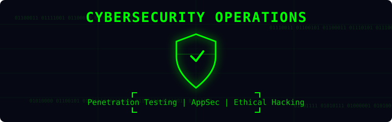
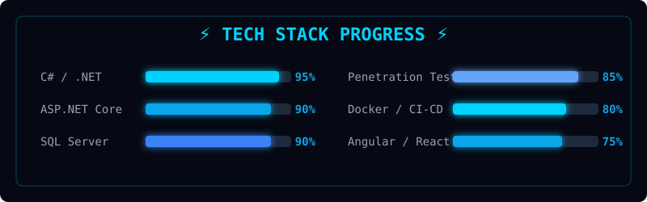
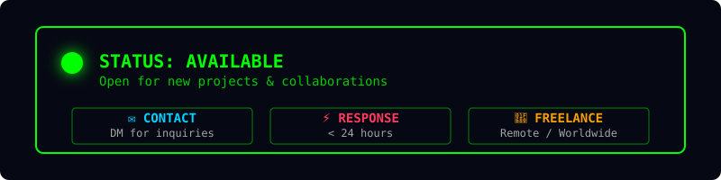

<p align="center"><b>.NET Backend Developer | Cybersecurity Analyst | Penetration Tester</b></p>
<p align="center">
 <a href="https://github.com/3bdelazizmo7amed3bdelaziz-beep"></a>
 <a href="https://linkedin.com/in/abdelaziz-mohamed-b0ba4a343"></a>
 <a href="mailto:3bdElazizMo7amed3bdElaziz@gmail.com"></a>
</p>

<p align="center"><i>Building secure, scalable backend systems and hardening applications through OWASP-driven pentesting — from clean architecture and APIs to vulnerability assessments and security audits.</i></p>

---

### 💻 HERO TERMINAL


```text
┌──────────────────────────────────────────────────────┐
│ abdelaziz@systems:~$                                 │
│                                                      │
│ $ whoami                                             │
│ Abdelaziz Mohamed Abdelaziz Ali                      │
│                                                      │
│ $ role                                               │
│ .NET Backend Developer & Cybersecurity Analyst       │
│                                                      │
│ $ stack                                              │
│ C# • ASP.NET Core • EF Core • Pentesting • DevOps    │
│                                                      │
│ $ mission                                            │
│ Build • Secure • Scale • Architect                   │
│                                                      │
│ SYSTEM STATUS: ONLINE ●                              │
└──────────────────────────────────────────────────────┘
```
---

### ✨ About Me — End-to-End Builder


I'm **Abdelaziz Mohamed** — **Backend & Security Engineer** from **Cairo, Egypt** 

> Instead of being *just* a backend dev or *just* a pentester, I connect the dots: **Architecture → ASP.NET Core → EF Core → SQL Server → REST API → Docker → Security Audit**. That **End-to-End** perspective is my edge. Aiming for Senior/Architect-level backend engineering.

- 🔒 **Application Security & Pentesting** — Gray-box web app pentests, OWASP Top 10, vulnerability assessments
- 🚀 **6+ Systems & Applications Built** — Enterprise backends, ERP systems, AI security platforms
- 🧪 **5 Intensive Bootcamps (2026)** — NTI (72h + 120h), ITI Cybersecurity, ITI .NET, Rowad Masr
- 📍 **Cairo, Egypt** | 📧 [3bdElazizMo7amed3bdElaziz@gmail.com](mailto:3bdElazizMo7amed3bdElaziz@gmail.com)

**Pipeline:** `Architecture → C# / ASP.NET Core → EF Core → SQL Server → REST API → Docker → Pentest`

---

### 🛡️ SECURITY OPERATIONS



**RECON → SCANNING → ENUMERATION → VULNERABILITY → EXPLOITATION → ANALYSIS → REMEDIATION → REPORT**

**Tools:** Burp Suite, Nmap, Metasploit, Wireshark, Gobuster, ffuf, SQLmap, OWASP, SAST, DAST

---

### 🛠️ Tech Stack & Tools



#### Tools I Actually Use

<p align="left">
  
  
  
  
  
  
  
  
  
  
</p>

| Category | Technologies |
|---|---|
| **Languages** | C#, JavaScript, TypeScript, Python, HTML, CSS, SQL |
| **Backend** | .NET Core, ASP.NET Core, EF Core, Node.js, Express, REST APIs, JWT, Microservices |
| **Databases** | SQL Server, MySQL, MongoDB |
| **Security** | Burp Suite, Nmap, Metasploit, Wireshark, OWASP ZAP, Nikto |

---

### 📈 SYSTEM STATUS



```text
SYSTEM STATUS
---------------------
SECURITY ONLINE ●
DEVELOPMENT ONLINE ●
DEVOPS ONLINE ●
BUILD STATUS STABLE
ENVIRONMENT LINUX
MODE ENGINEERING
```

---

### 💼 Experience & Projects

```text
┌─────────────────────────────────────────────────────────────────────────┐
│ 💻 Backend Developer (Freelance)          │  Jun 2023 – Present        │
│    ▸ Full-stack apps end-to-end with C#/ASP.NET Core/EF Core           │
│    ▸ ClothFlow ERP (Inventory, POS, Sales, HR, Finance)                │
├─────────────────────────────────────────────────────────────────────────┤
│ 🔒 Cybersecurity Analyst — Web Pentesting │  Jan 2025 – Present        │
│    ▸ Gray-box web app pentests (OWASP Top 10 methodology)              │
│    ▸ Professional vuln reports (SQLi, XSS, Auth Bypasses, IDOR)        │
└─────────────────────────────────────────────────────────────────────────┘
```

| Project | Description | Tech Stack |
|---|---|---|
| **🌟 AI Cyber Security Platform** | AI-driven cybersecurity platform for automated threat monitoring & security analysis. | `C#` `.NET` `ASP.NET Core` `SQL Server` `AI/ML` `AppSec` |
| **🌟 ClothFlow ERP System** | Enterprise Resource Planning for fashion retail — Inventory, POS, Sales, HR, Finance. | `Node.js` `Angular 18` `MongoDB` `Docker` `Playwright` |
| **🛡️ Web Pentest Reports** | Professional gray-box pentesting reports with automated PoC generation using Python. | `Burp Suite` `Python` `OWASP` `Nmap` |
| **☕ Coffee Management System** | C# console app with EF Core (Code First), full CRUD, data annotations. | `C#` `EF Core` `SQL Server` `.NET 8` |

---

### 🏆 Training & Certifications (2026)

| Program | Institution | Key Topics |
|---|---|---|
| **Penetration Testing & AppSec** | NTI (72 Hours) | Vulnerability Assessment, Cloud Security, Threat Hunting |
| **Cybersecurity Certified Program** | ITI (Assuit Branch) | Network Fundamentals, Ethical Hacking, HCCDA Huawei Cloud |
| **Web Development using .NET** | ITI (Sohag Branch) | C#, EF Core, SQL Server, ASP.NET MVC, Generative AI |
| **Vulnerability Analyst & Pentester** | Rowad Masr Al-Raqamiya | Infrastructure & Security, Mastercard Standards |

---

### 📈 GitHub Stats

<p align="center">
  
  
</p>

<p align="center">
  
</p>

<!-- GitHub Snake Animation -->
<p align="center">
  <picture>
    <source media="(prefers-color-scheme: dark)" srcset="https://raw.githubusercontent.com/3bdelazizmo7amed3bdelaziz-beep/3bdelazizmo7amed3bdelaziz-beep/output/github-contribution-grid-snake-dark.svg">
    <source media="(prefers-color-scheme: light)" srcset="https://raw.githubusercontent.com/3bdelazizmo7amed3bdelaziz-beep/3bdelazizmo7amed3bdelaziz-beep/output/github-contribution-grid-snake.svg">
    
  </picture>
</p>

<p align="center">
  <i>"Building fortresses of code and breaking them to make them stronger — that's how secure systems are born."</i>
</p>

<p align="center">
 
</p>
